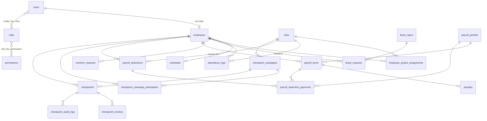

# BT-Attendance — System Architecture

> The complete architecture of the BT-Attendance system: what it is built from, how a request moves through it, every module and its rules, every table, every route, the background jobs, the frontend, configuration, testing, deployment, and where other systems (BT-Inventory) plug in.
> Generated from the code on 21 Sep 2026. Roles are also published as `BT-Attendance-Role-Permissions.xlsx`.

---

> **Branches.** `main` is the original Laravel/PHP implementation (last commit `FINALIZED/PHP-LOANS&PAYSLIPS&MOBILE`).
> From the `django` branch on, the same system is implemented in Django 5.2 — same screens, routes, tables, permissions
> and payroll rules described below. Laravel file paths in this document (`app/…`, `resources/views/…`, `routes/web.php`)
> refer to `main`; §29 maps each concern to its Django equivalent (`<app>/views.py`, `templates/…`, `core/…`).

## Contents

1. [Overview](#1-overview)
2. [Technology stack](#2-technology-stack)
3. [Runtime topology](#3-runtime-topology)
4. [Request lifecycle](#4-request-lifecycle)
5. [Identity, roles and permissions](#5-identity-roles-and-permissions)
6. [Module: Dashboard](#6-module-dashboard)
7. [Module: Attendance (clock in/out)](#7-module-attendance-clock-inout)
8. [Module: Locations, geofences and project assignments](#8-module-locations-geofences-and-project-assignments)
9. [Module: Attendance Log and timesheets](#9-module-attendance-log-and-timesheets)
10. [Module: Leave](#10-module-leave)
11. [Module: Overtime](#11-module-overtime)
12. [Module: Employees](#12-module-employees)
13. [Module: Payroll](#13-module-payroll)
14. [Module: Check Point](#14-module-check-point)
15. [Module: User Management and Profile](#15-module-user-management-and-profile)
16. [Notifications](#16-notifications)
17. [Scheduled jobs](#17-scheduled-jobs)
18. [Database schema](#18-database-schema)
19. [Route map](#19-route-map)
20. [Services and support classes](#20-services-and-support-classes)
21. [Frontend](#21-frontend)
22. [Files and storage](#22-files-and-storage)
23. [Configuration and seed data](#23-configuration-and-seed-data)
24. [Testing and tooling](#24-testing-and-tooling)
25. [Deployment](#25-deployment)
26. [Integration: BT-Inventory single sign-on](#26-integration-bt-inventory-single-sign-on)
27. [Directory map](#27-directory-map)
28. [Glossary](#28-glossary)

---

## 1. Overview

BT-Attendance is one Laravel application that runs, for Brite-Tech:

| Area | What it does |
|---|---|
| Attendance | Selfie + GPS clock in/out on the phone, checked against the office and project-site geofences; personal history; HR's daily Attendance Log; monthly timesheets; printable proof-of-attendance softcopies |
| Leave and overtime | Employees file leave, early-leave and overtime requests; HR approves or denies; actual OT hours come from the punches, never typed in |
| Employees and locations | Employee records with login accounts, schedules, salary and payout method; project sites with geofences and date ranges; assignment of employees to sites |
| Payroll | Fixed semi-monthly schedule (1st–15th paid on the 15th, 16th–last day paid on the last day); company-wide rates; automatic computation from attendance, leave, OT, contributions, loans and missing-item charges; review, edit, release; payslips, printing and Excel register |
| Check Point | Ask every employee on a project site to prove presence with a live photo within a time window; HR sees who completed it and who did not |
| Administration | Roles and permissions, user accounts, temporary passwords, live presence |

Employees use it on their phones; HR (Admin), the Developer and the Super Admin use it on desktop. There is no separate API, mobile app or SPA — one codebase serves every screen with server-rendered pages.

## 2. Technology stack

| Layer | Choice | Notes |
|---|---|---|
| Language / framework | PHP 8.3 · Laravel 13 | Classic MVC monolith |
| Authentication | Laravel Breeze (username + password), `spatie/laravel-permission` 8 | Roles/permissions stored as data, seeded from `App\Support\RoleMatrix` |
| Database | SQLite (development) · MySQL/MariaDB (production) | Same migrations; 28 application tables + Laravel's |
| Sessions, cache, queue | Database drivers (`sessions`, `cache`, `jobs`) | No Redis needed |
| Views | Blade + Tailwind CSS v4 (CSS-first) + Alpine.js 3 | Built by Vite 8 |
| Maps | Leaflet 1.9 + OpenStreetMap tiles | Site picker, geofence preview, punch map links |
| Geo maths | Haversine in `App\Support\Geo` | No paid geocoding; address lookup uses the public Nominatim endpoint from the browser |
| Images | `intervention/image` | Stamped selfies, softcopies, checkpoint photos |
| Spreadsheets | `phpoffice/phpspreadsheet` | Employee import/export, payroll register, role matrix workbook |
| Scheduling | Laravel scheduler (`routes/console.php`) | One cron line on the server |
| Testing | PHPUnit feature tests, Laravel Pint | 123 tests |

## 3. Runtime topology

```
                        ┌─────────────────────────────────────────────────┐
  phones / browsers ──▶ │ Nginx or Apache → PHP-FPM → Laravel (public/)    │
       (HTTPS)          │                                                 │
                        │  routes/web.php ─ middleware ─ controllers       │
                        │        │                  │            │         │
                        │     Blade views      services      notifications │
                        └────────┬──────────────────┬────────────┬─────────┘
                                 │                  │            │
                          public/build        MySQL / SQLite   notifications
                          (Vite assets)       (all tables)     table (bell)
                                 │
                          storage/app/public   selfies, profile photos   ← public/storage symlink
                          storage/app/private  checkpoint photos         ← served through a permission check

  cron: * * * * * php artisan schedule:run
        ├─ checkpoints:tick   every minute   start scheduled campaigns, expire lapsed checkpoints
        └─ payroll:tick       07:00 daily    roll payroll periods forward, pay-day reminder
```

One deployable unit. PHP is stateless, so more web nodes can be added behind a load balancer as long as they share the database and the storage directory; the current size does not need it.

HTTPS is required in production: the camera (`getUserMedia`) and geolocation APIs only work on secure origins.

## 4. Request lifecycle

1. **Routing** — `routes/web.php`. Everything except login/password-reset is inside `auth`. Pages are grouped by permission with the `permission:` middleware (`spatie`), e.g. `permission:run payroll`. Where a page is "mine, or anyone's with a permission" (timesheet, softcopy, checkpoint photo) the controller checks ownership.
2. **Global web middleware** (`bootstrap/app.php`, appended to the `web` group):
   - `TrackUserPresence` — writes `users.last_seen_at` (throttled) so User Management can show Online/Offline.
   - `RequirePasswordChange` — when `users.must_change_password` is true, every request except the password-change and logout routes is refused (JSON 423 for XHR, redirect with an error bag for pages) and the layout shows a modal that cannot be dismissed.
3. **Controller** — validates input, delegates to a service or model method, returns a Blade view or redirects with a flash `status`.
4. **Service and support classes** — the rules (geofence, work sessions, payroll maths, campaign lifecycle) live in `app/Services` and `app/Support`, so controllers, scheduled commands and tests use one implementation.
5. **View** — Blade templates composed of components (`resources/views/components`) that implement the design system; Alpine adds interactivity without a build-time framework.
6. **Response** — HTML; a few JSON endpoints exist for polling (`/users/presence`, `/my-checkpoints/active`, `/checkpoints/campaigns/{id}/status`, `/settings/sites/resolve-link`).

## 5. Identity, roles and permissions

### Accounts

- **Login is username + password.** Usernames are normalised (`User::normalizeUsername`) and follow the company prefix, e.g. `brite-juan`. There is no self-registration; accounts are created from the Employees form (which creates both the employee record and the user) or User Management.
- A `users` row is the login and carries: `username`, `name`, `email`, `password`, `profile_photo_path`, presence (`last_seen_at`, `last_login_at`, `last_login_ip`), `disabled_at`, `deleted_at` (soft delete, restorable) and `must_change_password`.
- An `employees` row is the HR record. Every employee has exactly one user; a user without an employee is management-only (the Super Admin).

### Temporary passwords

Any password set by an administrator (new employee, import, User Management, Employees edit) is temporary: `User::setTemporaryPassword()` stores it and sets `must_change_password`. On the next request the `RequirePasswordChange` middleware blocks everything and the layout opens a modal where the user enters the temporary password and a new one (`PUT /password/temporary`, must differ from the current). `User::setOwnPassword()` clears the flag; a password reset by e-mail also clears it.

### Roles and permissions

`App\Support\RoleMatrix` is the single source of truth:

- `PERMISSIONS` — every permission with its module and a plain-English description of what it unlocks (`reserved` ones exist for future pages).
- `DEFAULTS` — the permissions each role starts with. The seeder builds the database from this; the workbook is generated from it.
- `ASSIGNABLE` — which roles a role may hand out (nobody can assign a role above their own).
- `LOCKED_SUPERADMIN` — `manage users` can never be removed from the Super Admin, so nobody can lock every administrator out.

| Role | Meant for | Summary |
|---|---|---|
| `superadmin` — Super Admin (CEO) | Owner | Every management module including accounts, roles, payroll rates, edits and release. Management only: no clock in/out, leave, OT or checkpoints |
| `developer` — Developer | Software / IT | Accounts, settings, locations, checkpoint configuration, reports; kept out of money and HR decisions by default |
| `admin` — Admin | HR officer / office admin | Employees, Attendance Log, approvals, payroll (run and review), Check Point — plus their own attendance |
| `employee` — Employee | Everyone else | Self-service only |

Permissions by module:

| Module | Permission | Unlocks |
|---|---|---|
| Self-service | `clock attendance` | Clock In / Out (selfie + GPS, geofence check) · My Attendance and own monthly timesheet · own softcopies · My Checkpoints (only while assigned to a project site with a checkpoint they are part of) · dashboard clock tile, recent punches, next pay day |
| Self-service | `request leave` | Leave page: file leave and early-leave requests |
| Self-service | `request overtime` | Overtime page: file OT requests |
| Self-service | `view own payslip` | My Payslips |
| Approvals | `approve requests` | Approve / deny leave, early-leave and OT · verify a 13h+ day · approve or reject a punch outside every geofence or without GPS |
| Attendance | `view team reports` | Attendance Log (everyone's time in/out by date, search, counts, overnight `+1`) · any employee's timesheet · anyone's softcopies |
| Employees | `manage employees` | Employees list · add / edit · Excel import · activate / deactivate · project-site assignment |
| Employees | `export employees` | Employee list as Excel |
| Payroll | `run payroll` | Payroll page · run / recalculate · salary history · Loans & Missing Items (view) |
| Payroll | `view all payslips` | Open anyone's payslip |
| Settings | `manage settings` | Umbrella for settings pages |
| Settings | `manage sites` | Locations / geofences |
| Settings | `manage schedules` | Work schedules (reserved) |
| Settings | `manage payroll rates` | Payroll Rates · edit a payroll line · release payroll · record / edit / cancel loans and missing-item charges — Super Admin only by default |
| Users | `manage users` | User Management |
| System | `view audit log`, `view system health` | Reserved |
| Check Point | `view checkpoint module` | Sidebar entry, list, history, daily view |
| Check Point | `create checkpoint campaign` | Create / edit drafts |
| Check Point | `activate checkpoint campaign` | Activate now / schedule / random schedule |
| Check Point | `pause checkpoint campaign` | Pause / resume |
| Check Point | `end checkpoint campaign` | End early · cancel · mark completed |
| Check Point | `view checkpoint results` | Results, checkpoint detail, stamped photos |
| Check Point | `review checkpoint exceptions` | Classify missed / failed, approve or reject exceptions, escalate |
| Check Point | `export checkpoint reports` | CSV export |
| Check Point | `manage checkpoint settings` | Defaults and the instruction library |

Enforcement is always by permission (`permission:` middleware, `@can`, `$user->can()`), never by role name, so a permission granted to another role works everywhere immediately. Money is gated separately from HR: `run payroll` sees and computes; `manage payroll rates` changes figures and releases.

### Presence

`TrackUserPresence` stamps `last_seen_at`; a user is **online** if seen within `User::PRESENCE_ONLINE_WITHIN` (300 s). User Management polls `GET /users/presence?ids=…` every 30 s so an open tab stops claiming someone is here after they leave. Disabled users cannot log in (`disabled_at`), soft-deleted users can be restored.

## 6. Module: Dashboard

`DashboardController::index` builds one page per role from permissions:

- **Hero** — live clock (Asia/Manila), greeting, employee no. and schedule, Clock in / out button (for `clock attendance`).
- **Four stat tiles**, in order of relevance: Today (clocked in / out / not yet), My pending leave, My pending OT, Awaiting your approval (approvers), Active employees (`manage employees`), Online now (`manage users`), Payroll status (`run payroll` — *Next pay day Sep 30 · in 11 days*, *Pay day is today*, *Ready to release*, *Payroll overdue*), Next pay day (employees). Always four so the row stays composed; 2-up on phones.
- **Quick actions** — shortcuts by permission (clock, file leave, request OT, review requests, attendance log, add employee, Check Point, Locations, User Management).
- **Recent attendance** (last 5 punches) and **My requests** (last 5 leave/OT with status) for people who clock in.

For users with `run payroll` the dashboard also calls `PayrollRunner::rollForward()` so payroll periods are up to date even without cron.

## 7. Module: Attendance (clock in/out)

### Screen

`GET /attendance` is an immersive, camera-first page (`resources/views/attendance/create.blade.php`): full-screen live camera, Time In / Time Out toggle, a mini map, the live stamp (type, time, date, address, coordinates, accuracy, location status) and a shutter button. The page:

1. Asks for camera and GPS. If the camera is unavailable it explains why (HTTPS required) and offers *Try again*; if GPS is denied or inaccurate it shows a panel with *Retry GPS* and a reason field for HR.
2. Runs the geofence check **client-side for feedback only** (distance to each active site), then captures a selfie as a data URL.
3. Submits `log_type`, `latitude`, `longitude`, `gps_accuracy`, `location_reason`, `photo` (base64) to `POST /attendance`.

### Server flow (`AttendanceController::store`)

```
validate ──▶ GeofenceService::evaluate(employee, lat, lng, accuracy)
                 │  nearest active site, distance, accuracy → GeofenceResult{status, site, message}
                 ▼
          blocks?  ── strict mode and not verified ──▶ 422 back with error
                 │
          exception (outside area / no GPS / low accuracy) and no reason? ──▶ ask for a reason
                 │
          store stamped selfie → storage/app/public/attendance/{employee}/…
                 │
          AttendanceLog row: log_type, logged_at (server time), GPS, distance_m, gps_accuracy_m,
                             within_geofence, site_id, assigned_site_id, location_status,
                             location_validation_message, location_reason,
                             location_verification_status (null | pending | …), photo_path
                 │
          exception ──▶ notify everyone with `approve requests` (LocationExceptionFlagged)
                 │
          redirect to My Attendance with the message and a one-click softcopy download
```

The server never trusts what the client showed: coordinates are re-evaluated, the time is the server's, and the photo is re-encoded and stamped.

### Location statuses (`GeofenceService`)

| Status | Meaning | Recorded? |
|---|---|---|
| `verified_location` | Inside the geofence of the assigned site or the main office | Yes |
| `authorized_alternate_location` | Inside another active site's geofence (e.g. sent to a different project for the day) | Yes, noted on the message |
| `outside_authorized_area` | Outside every active geofence | Depends on mode |
| `gps_unavailable` | No coordinates | Depends on mode |
| `low_accuracy` | Reported accuracy worse than `min_gps_accuracy_m` (100 m default) | Depends on mode |

Mode (`ATTENDANCE_GEOFENCE_MODE`): **warning** (default — record and flag for HR), **approval** (record as `pending` until HR approves), **strict** (reject). The main office is always a valid place to clock in, even for staff assigned to a project.

### Sessions, hours, overnight shifts

Days and hours are **derived at read time** from raw punches — nothing is pre-aggregated:

- `WorkSessions::pair(logs)` walks punches in time order and pairs each Time In with the next Time Out; an open session (no Out yet) is kept as open.
- `WorkSessions::startingOn(sessions, date)` assigns a session to the day it **started**, so a `10:15 PM → 12:05 AM` shift belongs to the first day and appears once, shown as `10:15 PM – 12:05 AM⁺¹` (`x-next-day` component). The next morning's 9:00 AM punch is a new session on the next day; no duplicate rows.
- `WorkSessions::workedMinutes()` sums closed sessions; `WorkHours::split(minutes, restDay)` returns regular vs overtime (first 8 h regular on a weekday; every minute is overtime on Sat/Sun).
- A day of 13 h or more (`WorkHours::needsVerification`) is flagged on the Attendance Log until HR verifies it (`POST /attendance/{log}/verify`) — catches forgotten clock-outs.
- Schedules: fixed (`time_in`, `time_out`, `grace_minutes`) or flexible (`is_flexible`). Late = minutes after time-in + grace; undertime = minutes out before time-out; early in is allowed and does not affect pay.

### Softcopies

`GET /attendance/{id}/softcopy/{in|out}` renders a PNG proof of one punch (`AttendanceSoftCopy`): reference `ATT-{id}-IN`, employee, time, site, distance, status (`On time`, `Late`, `Early In`, …), and the selfie. Own records, or anyone's with `view team reports`.

## 8. Module: Locations, geofences and project assignments

### Sites (`settings/sites`)

A `sites` row is a place where attendance is valid:

| Field | Purpose |
|---|---|
| `type` | `office` (main office, always valid), `project_site`, `temporary` (alternate site) |
| `latitude`, `longitude`, `geofence_radius_m` | The circle; 150–300 m suits most sites |
| `status` | `active` accepts punches; `inactive`; `completed` (project finished) |
| `active_from`, `active_until` | Project duration; the form has a "Project duration = N days/weeks/months" helper that fills `active_until` |
| `client_name`, `address`, `is_headquarters` | Display |

The form (`sites/_form.blade.php`) has a Leaflet map picker (click or drag the pin), a Google-Maps-link paster (`GET /settings/sites/resolve-link` expands short links server-side), an address lookup, a radius slider with presets, and "use my current location". `PATCH /settings/sites/{site}/status` toggles status. The Locations list shows live / deployed / ending / finished counts.

### Assignments

`employee_project_assignments` (employee, site, `start_date`, `end_date`, `status`, notes) put an employee on a project site for a period. `Employee::assignedSite()` resolves the current one. It is created from the employee form (`POST /employees/{employee}/assignments`) and ended with `PATCH …/assignments/{assignment}/end`. The assignment decides:

- which geofence is "verified" for that employee (office is always verified as well);
- whether the employee sees **My Checkpoints** (`Employee::hasCheckpointAccess()` — assigned site has a campaign they are a participant of);
- the "Project site" column across Employees, Attendance Log and the dashboard.

Finishing a project (`status = completed` or `active_until` passed) stops new punches at that site without touching history.

## 9. Module: Attendance Log and timesheets

- **My Attendance** (`GET /attendance/logs`, `clock attendance`) — the employee's own history for a month: days worked, minutes, lates (against schedule + grace), last punch; every row has softcopy links.
- **Attendance Log** (`GET /attendance/monitor`, `view team reports`) — everyone's Time In / Time Out for one date, with a date stepper, *Today*, search by any words of a name / number / username (`Employee::scopeSearch`), and counts: worked today, still clocked in, day off, needs your check. Rows show the selfie thumbnail, site, map link, location badge, hours (regular / OT), status (present, late, no time out, day off), and — for `approve requests` — the *Verify* (13h+) and *Approve / Reject location* actions. Weekend dates show a "rest day — anyone on site is on rest-day OT (130%)" banner.
- **Monthly timesheet** (`GET /attendance/timesheet/{employee}`) — one row per calendar day with time in/out (with `+1` for overnight), hours, regular/OT split, sessions, location, status (`present`, `open`, `incomplete`, `leave`, `absent`, `rest`, upcoming), month totals, and links to the daily log. Own, or anyone's with `view team reports`. On phones, empty days collapse to date + status.

## 10. Module: Leave

- **Types** (`leave_types`, seeded): Service Incentive Leave (5), Vacation Leave, Sick Leave, Maternity (105), Paternity (7), Solo Parent (7), Special Leave for Women (60), Bereavement (3); each with `default_days_per_year` and `is_paid`.
- **Regular leave** (`POST /leave`): leave type, `day_portion` (`full`, `half_am`, `half_pm`), date range, reason. Full day spans the range and counts consecutive days; a half day is one date worth 0.5. Duplicate/overlapping requests are refused.
- **Early leave / sick today** (`POST /leave/early`): today's date, `requested_time_out`, reason; stored as `is_early_leave` with `leave_type` Sick Leave when present. It excuses the undertime in payroll once approved.
- **Approval** (`POST /leave/{leave}/approve|deny`, `approve requests`) with optional remarks; the employee is notified (`RequestReviewed`). Approvers were notified when it was filed (`ApprovalRequested`).
- **Effect on pay** — an approved full-day leave excuses the absence and the late for that day; an approved half day withholds 0.5 × daily rate; an approved early leave excuses undertime. Pending or denied requests have no salary effect.

The Leave page doubles as the approval queue: approvers see everyone's requests, employees see their own, with pending / approved-this-month / days-this-year / denied counts.

## 11. Module: Overtime

- **Request before working** (`POST /overtime`): `ot_date` (today or future; up to 3 days back for late filing, e.g. weekend site work filed on Monday), planned window (`planned_start`, `planned_end`; 15 min – 12 h, may cross midnight), reason (min 10 chars). `ot_type` is derived from the date: `regular` (Mon–Fri) or `rest_day` (Sat/Sun). One pending/approved request per date.
- **Approval** (`approve requests`), then **actual hours are derived from attendance** (`OvertimeController::syncActualHours`): for fixed-schedule weekdays, OT = actual out − scheduled out; for flexible staff or weekends, OT = worked time beyond 8 h (all of it on a rest day). Never typed in.
- **Payroll** pays approved OT **one cutoff in arrears** (hours are final by then), capped at the approved hours, at the premium (125 % regular, 130 % rest day, 200 % holiday) × hourly rate.
- **13h+ verification** on the Attendance Log is separate from the request and guards against forgotten clock-outs.

## 12. Module: Employees

`manage employees` unlocks the Employees list (search, status filter, counts active / on project / inactive / monthly payroll), **Add employee** (creates the login too: username auto-generated as `brite-firstname` if blank, temporary password auto-generated or typed, role limited by `RoleMatrix::ASSIGNABLE`), **Edit** (profile, schedule, salary, payout method — `cash` with payslip in envelope or `card` with account number — status, role, reset password, project assignment), **activate / deactivate** (`PATCH /employees/{employee}/status`), **Import Excel** (template download, row validation with a skipped-rows report, creates users with temporary passwords) and **Export Excel** (`export employees`). Salary history per employee (`run payroll`).

Employee fields: `employee_no` (auto `EMP-0001`…), names, `email`, `phone`, `employee_type`, `schedule_id`, `monthly_salary`, `daily_rate`, `date_hired`, `status` (`active`, `inactive`, `on_leave`), `payout_method`, `bank_account_no`.

## 13. Module: Payroll

### Schedule (fixed)

| Cutoff | Days | Paid on |
|---|---|---|
| First half | 1st – 15th | the 15th |
| Second half | 16th – last day | the last day of the month |

`PayrollPeriod::cutoffFor(date)` / `ensureFor(date)` compute and create the period for any date (`pay_date = period_end`). `PayrollRunner::rollForward()` creates every period from the last known one up to the current cutoff plus the next; it runs from the daily tick, the payroll page and the dashboard, so periods are right even without cron.

### Nothing runs on its own

- 07:00 on pay day, `payroll:tick` sends **`PayrollDue`** once per period to everyone with `run payroll`.
- `PayrollRunner::status()` tells the payroll page and dashboard what is needed: `upcoming` (next pay day in N days), `due` (pay day today, not computed), `computed` (ready to release), `overdue` (a past cutoff never computed).
- A person presses **Run payroll** (`POST /payroll/{period}/generate`) — or **Recalculate** later; hand-edited lines are kept unless forced.

### Rates (`manage payroll rates`, `GET/PUT /payroll/rates`)

Company-wide percentages in `settings` under `payroll.rates.*` (`PayrollRates::DEFAULTS`): basic pay per cutoff 50 %, working days per month 22, hours per day 8, allowance 0 %, OT regular 125 %, rest day 130 %, holiday 200 %, withholding tax 0 %, Pag-IBIG monthly cap ₱200. Contribution brackets (`contribution_rates`: type, salary range, employee %, employer %, EC, year) for SSS, PhilHealth, Pag-IBIG are edited on the same page, with a live preview for any salary.

### Computation (`PayrollCalculator::calculate(employee, period)`)

Inside one DB transaction, per employee:

1. **Basic** = monthly salary × basic %. Daily rate = monthly ÷ working days; hourly = daily ÷ hours per day; per-minute = hourly ÷ 60.
2. **Absences** — expected working days (Mon–Fri) in the cutoff minus days with a session; approved full-day leave is excused; only deducted when the employee has any logs in the period (never zeroes a period with no data yet).
3. **Late / undertime** — minutes after time-in + grace and minutes before time-out, at the per-minute rate; approved early leave or half day excuses undertime, only full-day leave excuses late.
4. **Half-day leave** — each approved half day withholds 0.5 × daily.
5. **Overtime** — approved requests from the **previous** cutoff, actual hours from attendance capped at approved, × premium.
6. **Allowance** — company % of basic (or what HR typed on the line).
7. **Contributions** — monthly SSS / PhilHealth / Pag-IBIG from the brackets, split 50/50 across the two cutoffs; Pag-IBIG capped.
8. **Withholding tax** — flat % of gross minus contributions.
9. **Loans and missing items** — first reverse whatever this line took last time (`reverseDeductionPayments`, so a recalculation never charges twice), then take this cutoff's installment from every active balance due (`PayrollDeduction::scopeDueFor`), writing one `payroll_deduction_payments` row per balance and reducing the balance (`collect()`; auto-`paid` at zero).
10. `PayrollItem::recomputeTotals()` — gross, total deductions, net.

Lines with `adjusted_at` (edited by hand via `GET /payroll/lines/{item}/edit`, `manage payroll rates`) are skipped unless the run is forced; **Reset** recomputes one line from scratch.

### Loans and missing items (`/payroll/deductions`)

One form, one dropdown: **Loan — one employee** (pick the employee) or **Missing item — one or more employees** (pick the site, tick the people responsible; cost split evenly, remainder on the first). Amount, "pay back over N cutoffs" (installment = ceil(amount ÷ N) to cents), start date, remarks. Rows carry `type`, `group_id` (one incident split across people), `total_amount`, `installment_amount`, `balance`, `status` (`active`, `paid`, `cancelled`). Editing changes the installment or start; cancelling stops collection (what was taken stays on past payslips). If the current cutoff is already computed and not released, affected lines are refreshed immediately. Everyone with `run payroll` can see the page; only `manage payroll rates` can record, edit or cancel.

### Review, release, payslips

- Payroll page: period selector with status (open → processing → closed), pay-day bar, summary tiles, earnings and deductions breakdown bars, one line per employee (payout, basic, OT, allowances, gross, deductions, net — negatives shown as `−₱250.00` in red), Payslip and Edit actions.
- **Release** (`POST /payroll/{period}/release`, `manage payroll rates`) after the money is out: closes the period, records `released_at`/`released_by` and the timing vs pay date (*on time · 2 days late*), and notifies every employee (`PayslipReleased`). Until then no employee sees a payslip.
- **Payslips** — `GET /payroll/item/{item}` (own with `view own payslip`, anyone's with `view all payslips` or `run payroll`); *My Payslips* lists released cutoffs with YTD totals. The payslip shows every line including `Loan · description · balance after: ₱…` and `Missing item · description (site)`.
- **Print** — `GET /payroll/{period}/print?employee=ID` for one slip (search box on the payroll page) or `?method=cash|card` / all for batches (one slip per page for envelopes).
- **Excel register** — `GET /payroll/{period}/export`: every column including Loan and Missing item, with totals.
- **Close** (`POST /payroll/{period}/close`) locks a period without releasing.

## 14. Module: Check Point

A **campaign** asks every participant on one project site to photograph an instruction (e.g. *Capture the project entrance*) with the live camera within a response window.

### Lifecycle (`CampaignManager`)

```
draft ──activate now──▶ active ──window ends──▶ expired / completed
  │  └──schedule (fixed time or random within a window)──▶ scheduled ──tick──▶ active
  │                                                                    ├─ pause ⇄ resume
  └── cancel                                                          └─ end now / mark completed
```

`checkpoint_campaigns`: `name`, `project_site_id`, `instruction`, `response_window_minutes` (default 10), `schedule_mode`, `scheduled_start_at` or `random_window_start/end`, `starts_at`, `expires_at`, `status` (`draft`, `active`, `paused`, `expired`, `completed`, `cancelled`), who did what and when. Participants are stored in `checkpoint_campaign_participants`; activation creates one `checkpoints` row per participant and notifies them (`CheckpointActivated`).

### Employee side

`Employee::hasCheckpointAccess()` — the employee's **current assignment** is the campaign's site and they are a participant — gates the *My Checkpoints* sidebar entry and the live popup (the layout polls `GET /my-checkpoints/active` every `poll_seconds`). `GET /my-checkpoints/{checkpoint}` opens the camera page; `POST` submits photo + GPS. `CheckpointVerifier::submit()` checks the live photo, distance to the site, GPS accuracy, server vs client timestamps and the deadline, stamps and stores the photo (`CheckpointPhoto`, private disk) and sets the result. Employees can *report an issue* (camera denied, no GPS) and *explain* a miss.

### Checkpoint statuses

`pending`, `notified`, `responded` (completed), `missed`, `outside_geofence`, `gps_unavailable`, `camera_permission_denied`, `submission_failed`, `pending_review`, `approved_exception`, `rejected_exception`.

### HR side

- **Check Point** list: running now / scheduled / completed today / not completed today; one row per campaign with *Completed X of Y*.
- **Campaign page** (simplified): name, status, site · instruction, timing (live countdown, fires at …), controls (Edit, Activate, Schedule, Pause/Resume, End, Cancel, Mark completed), completed / waiting / not completed / completion %, and one table: employee, no., result (Completed · Waiting · Not completed · Pending), time, details.
- **Results** (`view checkpoint results`): every checkpoint with the stamped photo (`GET /checkpoint-photos/{checkpoint}` — owner or permission), map, movement context; **follow-up** (`review checkpoint exceptions`): approve / reject exception with reason, note, escalate (`CheckpointReviewer`); HR actions notify the employee (`CheckpointReviewed`), flagged exceptions notify HR (`CheckpointExceptionFlagged`).
- **Daily view**, **History**, **CSV export** (`export checkpoint reports`), **Settings** (`manage checkpoint settings`: default response window, instruction library).
- Every transition is written to `checkpoint_audit_logs` and `checkpoint_reviews` (`CheckpointAudit`).

### Dispatcher

`checkpoints:tick` (every minute) → `CheckpointDispatcher::tick()`: start campaigns whose scheduled time has come, expire checkpoints whose window lapsed (marking `missed`), expire campaigns. A throttled `sweep()` also runs from web requests (`sweep_throttle_seconds`) so the module works without cron in development.

## 15. Module: User Management and Profile

- **User Management** (`manage users`): accounts (with employee no.), username, email, role, last sign-in, live status (online / offline / disabled / deleted), search and role/status filters; Edit (name, username, email, role within `ASSIGNABLE`, temporary password), disable / enable, delete (soft) / restore.
- **Profile** (everyone): name, username, email, profile photo (JPG/PNG/WebP ≤ 2 MB), change password, delete own account.

## 16. Notifications

All notifications use the **database channel** and appear in the bell in the top bar; `GET /notifications/{id}` marks one read and redirects to its `data.url`; `POST /notifications/read-all` clears the badge. Each stores `kind`, `title`, `message`, `url`.

| Class | Sent to | When |
|---|---|---|
| `ApprovalRequested` | everyone with `approve requests` | leave / early-leave / OT filed |
| `RequestReviewed` | the employee | leave / OT approved or denied |
| `LocationExceptionFlagged` | everyone with `approve requests` | punch outside every geofence / no GPS / low accuracy |
| `CheckpointActivated` | participants | campaign goes live |
| `CheckpointExceptionFlagged` | HR reviewers | a checkpoint is missed / failed / needs review |
| `CheckpointReviewed` | the employee | HR approved / rejected the exception |
| `PayrollDue` | everyone with `run payroll` | 07:00 on pay day, once per period |
| `PayslipReleased` | every employee on the payroll | Super Admin releases the period |

Adding e-mail or SMS later is a `via()` change per class; `MAIL_MAILER=log` in development.

## 17. Scheduled jobs

`routes/console.php`; one cron line on the server: `* * * * * cd /path && php artisan schedule:run >> /dev/null 2>&1`.

| Command | Cadence | Does | Safe to re-run |
|---|---|---|---|
| `checkpoints:tick` | every minute | start scheduled campaigns; expire lapsed checkpoints and campaigns | yes |
| `payroll:tick` | 07:00 daily | `rollForward()` periods; on pay day send `PayrollDue` once (`reminded_at`) | yes |

The queue (`jobs` table) exists but nothing requires a worker today; notifications are written synchronously.

## 18. Database schema

Types shown as stored; `?` = nullable. Laravel's `sessions`, `cache`, `jobs`, `failed_jobs`, `password_reset_tokens`, `migrations` and spatie's `roles`, `permissions`, `model_has_roles`, `model_has_permissions`, `role_has_permissions` are omitted.

### Identity

**users** — `id`, `name`, `email`, `email_verified_at?`, `password`, `remember_token?`, `profile_photo_path?`, `username`, `last_seen_at?`, `last_login_at?`, `last_login_ip?`, `disabled_at?`, `deleted_at?`, `must_change_password`, timestamps.

**employees** — `id`, `user_id?`, `employee_no?`, `first_name`, `last_name`, `email`, `phone?`, `employee_type`, `schedule_id?`, `monthly_salary`, `daily_rate`, `date_hired?`, `status`, `payout_method` (`cash` | `card`), `bank_account_no?`, timestamps.

**schedules** — `id`, `name`, `time_in?`, `time_out?`, `grace_minutes`, `is_flexible`, timestamps.

### Locations

**sites** — `id`, `name`, `client_name?`, `address?`, `latitude`, `longitude`, `geofence_radius_m`, `is_headquarters`, `type` (`office` | `project_site` | `temporary`), `status` (`active` | `inactive` | `completed`), `active_from?`, `active_until?`, `created_by?`, `updated_by?`, timestamps.

**employee_project_assignments** — `id`, `employee_id`, `site_id`, `start_date`, `end_date?`, `status`, `assignment_notes?`, `created_by?`, timestamps.

### Attendance

**attendance_logs** — `id`, `employee_id`, `site_id?` (site the punch landed in), `assigned_site_id?`, `log_type` (`time_in` | `time_out`), `logged_at`, `latitude?`, `longitude?`, `distance_m?`, `gps_accuracy_m?`, `within_geofence`, `location_status?`, `location_validation_message?`, `location_reason?`, `location_verification_status?`, `location_remarks?`, `location_verified_by?`, `location_verified_at?`, `photo_path?`, `synced_offline`, `ot_verification_status?`, `ot_remarks?`, `ot_verified_by?`, `ot_verified_at?`, timestamps.

### Leave and overtime

**leave_types** — `id`, `name`, `code?`, `default_days_per_year`, `is_paid`, timestamps.

**leave_requests** — `id`, `employee_id`, `leave_type_id?`, `date_from`, `date_to`, `days`, `day_portion` (`full` | `half_am` | `half_pm`), `is_early_leave`, `requested_time_out?`, `reason?`, `status` (`pending` | `approved` | `denied`), `approved_by?`, `approved_at?`, timestamps.

**overtime_requests** — `id`, `employee_id`, `site_id?`, `ot_date`, `planned_start?`, `planned_end?`, `requested_hours?`, `hours?` (actual, derived), `hours_synced_at?`, `ot_type` (`regular` | `rest_day` | `holiday`), `reason?`, `status`, `approved_by?`, `approved_at?`, `admin_remarks?`, timestamps.

### Payroll

**payroll_periods** — `id`, `period_start`, `period_end`, `pay_date?`, `cutoff_type` (`first_half` | `second_half`), `status` (`open` | `processing` | `closed`), `generated_at?`, `generated_by?`, `reminded_at?`, `closed_at?`, `closed_by?`, `released_at?`, `released_by?`, timestamps.

**payroll_items** — `id`, `employee_id`, `payroll_period_id`, `basic_pay`, `overtime_pay`, `night_diff_pay`, `holiday_pay`, `allowances`, `gross_pay`, `late_undertime_deduction`, `absences_deduction`, `half_day_deduction`, `sss_deduction`, `philhealth_deduction`, `pagibig_deduction`, `withholding_tax`, `other_deductions`, `loan_deduction`, `missing_item_deduction`, `total_deductions`, `net_pay`, `remarks?`, `adjusted_at?`, `adjusted_by?`, timestamps.

**payslips** — `id`, `payroll_item_id`, `file_path?`, `generated_at?`, timestamps.

**contribution_rates** — `id`, `contribution_type` (`sss` | `philhealth` | `pagibig`), `min_salary`, `max_salary?`, `employee_rate`, `employer_rate`, `ec_amount`, `effective_year`, timestamps.

**payroll_deductions** — `id`, `employee_id`, `type` (`loan` | `missing_item`), `site_id?`, `group_id?`, `description`, `incident_date?`, `total_amount`, `installment_amount`, `balance`, `starts_on`, `status` (`active` | `paid` | `cancelled`), `remarks?`, `created_by?`, `cancelled_at?`, `cancelled_by?`, timestamps.

**payroll_deduction_payments** — `id`, `payroll_deduction_id`, `payroll_item_id`, `payroll_period_id`, `amount`, timestamps.

### Check Point

**checkpoint_campaigns** — `id`, `name`, `project_site_id`, `instruction`, `reason?`, `response_window_minutes`, `schedule_mode?`, `scheduled_start_at?`, `random_window_start?`, `random_window_end?`, `starts_at?`, `expires_at?`, `status`, `created_by?`, `activated_by?`, `activated_at?`, `paused_by?`, `paused_at?`, `closed_by?`, `closed_at?`, timestamps.

**checkpoint_campaign_participants** — `id`, `campaign_id`, `employee_id`, timestamps.

**checkpoints** — `id`, `campaign_id`, `employee_id`, `project_site_id`, `status`, `verification_result?`, `failure_reason?`, `validation_message?`, `notified_at?`, `seen_at?`, `submission_attempts`, `last_attempt_at?`, `last_attempt_result?`, `issue_reported?`, `submitted_at?`, `server_timestamp?`, `client_timestamp?`, `latitude?`, `longitude?`, `gps_accuracy_meters?`, `distance_from_site_meters?`, `matched_site_id?`, `within_geofence?`, `photo_path?`, `network_status?`, `employee_explanation?`, `hr_reason?`, `hr_note?`, `escalated_at?`, `reviewed_by?`, `reviewed_at?`, timestamps.

**checkpoint_reviews** — `id`, `checkpoint_id`, `reviewer_id?`, `action`, `reason?`, `explanation?`, `note?`, `created_at`.

**checkpoint_audit_logs** — `id`, `campaign_id?`, `checkpoint_id?`, `user_id?`, `action`, `details?`, `ip_address?`, `created_at`.

### System

**settings** — `key` (PK), `value` (JSON), timestamps. Keys: `payroll.rates.*`, `checkpoints.defaults`, `checkpoints.instructions`.

**notifications** — Laravel's database notifications (`id` uuid, `type`, `notifiable_*`, `data` JSON, `read_at?`).

### Relationships



Soft deletes: `users` (restorable from User Management). Everything else is kept forever; statuses change instead of rows being deleted.

## 19. Route map

Grouped as in `routes/web.php`. All routes require `auth` unless marked public.

| Area | Method · URI | Name | Gate |
|---|---|---|---|
| Auth (public) | GET/POST `login`, POST `logout`, GET/POST `forgot-password`, GET/POST `reset-password/{token}`, GET/POST `confirm-password`, `verify-email…` | Breeze | — |
| Password | PUT `password` · PUT `password/temporary` | `password.update` · `password.temporary` | own |
| Dashboard | GET `/` → redirect · GET `dashboard` | `dashboard` | auth |
| Notifications | GET `notifications/{id}` · POST `notifications/read-all` | `notifications.open` · `.read-all` | own |
| Clock | GET `attendance` · POST `attendance` · GET `attendance/logs` | `attendance.create` · `.store` · `.index` | `clock attendance` |
| Attendance | GET `attendance/monitor` | `attendance.monitor` | `view team reports` |
| Attendance | GET `attendance/timesheet/{employee}` · GET `attendance/{id}/softcopy/{in\|out}` | `attendance.timesheet` · `.softcopy` | own or `view team reports` |
| Approvals | POST `attendance/{log}/verify` · POST `attendance/{log}/verify-location` | `attendance.verify` · `.verify-location` | `approve requests` |
| Leave | GET `leave` | `leave.index` | `request leave` or `approve requests` |
| Leave | GET/POST `leave/create`, `leave` · GET/POST `leave/early` | `leave.create` · `.store` · `.early.create` · `.early.store` | `request leave` |
| Leave | POST `leave/{leave}/approve\|deny` | `leave.approve` · `.deny` | `approve requests` |
| Overtime | GET `overtime` | `overtime.index` | `request overtime` or `approve requests` |
| Overtime | GET/POST `overtime/create`, `overtime` | `overtime.create` · `.store` | `request overtime` |
| Overtime | POST `overtime/{overtime}/approve\|deny` | `overtime.approve` · `.deny` | `approve requests` |
| Payslips | GET `my-payslips` | `payroll.mine` | `view own payslip` |
| Payslips | GET `payroll/item/{item}` | `payroll.show` | own, or `view all payslips` / `run payroll` |
| Employees | GET `employees`, GET/POST `employees/create`, `employees` · GET `employees/{e}/edit` · PUT `employees/{e}` · PATCH `employees/{e}/status` · GET/POST `employees/import` · GET `employees/import/template` · POST `employees/{e}/assignments` · PATCH `employees/{e}/assignments/{a}/end` | `employees.*` | `manage employees` |
| Employees | GET `employees/export` | `employees.export` | `export employees` |
| Employees | GET `employees/{e}/salary-history` | `employees.salary-history` | `run payroll` |
| Users | GET `users` · GET `users/presence` · GET `users/{u}/edit` · PUT `users/{u}` · PATCH `users/{u}/disabled` · DELETE `users/{u}` · POST `users/{id}/restore` | `users.*` | `manage users` |
| Rates | GET/PUT `payroll/rates` | `payroll.rates` · `.rates.update` | `manage payroll rates` |
| Sites | GET `settings/sites`, GET/POST `settings/sites/create`, `settings/sites` · GET `settings/sites/{s}/edit` · PUT `settings/sites/{s}` · PATCH `settings/sites/{s}/status` · GET `settings/sites/resolve-link` | `sites.*` | `manage settings` or `manage sites` |
| Payroll | GET `payroll` · POST `payroll/periods` · POST `payroll/{p}/generate` · GET `payroll/{p}/export` · GET `payroll/{p}/print` · POST `payroll/{p}/close` · GET/POST `payroll/deductions` · PUT `payroll/deductions/{d}` · POST `payroll/deductions/{d}/cancel` | `payroll.*`, `payroll.deductions*` | `run payroll` (deduction writes also need `manage payroll rates`) |
| Payroll | POST `payroll/{p}/release` · GET `payroll/lines/{i}/edit` · PUT `payroll/lines/{i}` · POST `payroll/lines/{i}/reset` | `payroll.release`, `payroll.lines.*` | `manage payroll rates` (checked in controller) |
| My Checkpoints | GET `my-checkpoints` · GET `my-checkpoints/active` · GET/POST `my-checkpoints/{c}` · POST `…/issue` · POST `…/explain` | `my-checkpoints.*` | `clock attendance` (+ participant) |
| Check Point | GET `checkpoints` · GET `checkpoints/daily` · GET `checkpoints/history` · GET `checkpoints/campaigns/{c}` · GET `checkpoints/campaigns/{c}/status` | `checkpoints.index` … | `view checkpoint module` |
| Check Point | GET/POST `checkpoints/create`, `checkpoints` · GET `checkpoints/campaigns/{c}/edit` · PUT `checkpoints/campaigns/{c}` | `checkpoints.create` · `.store` · `.edit` · `.update` | `create checkpoint campaign` |
| Check Point | POST `…/activate` · `…/schedule` · `…/schedule-random` | `checkpoints.activate` … | `activate checkpoint campaign` |
| Check Point | POST `…/pause` · `…/resume` | | `pause checkpoint campaign` |
| Check Point | POST `…/end` · `…/cancel` · `…/complete` | | `end checkpoint campaign` |
| Check Point | GET `checkpoints/campaigns/{c}/export` | `checkpoints.export` | `export checkpoint reports` |
| Check Point | GET `checkpoints/results` · GET `checkpoints/results/{c}` | `checkpoints.results.*` | `view checkpoint results` |
| Check Point | POST `checkpoints/results/{c}/follow-up` | `checkpoints.results.follow-up` | `review checkpoint exceptions` |
| Check Point | GET/PUT `checkpoints/settings` | `checkpoints.settings` · `.update` | `manage checkpoint settings` |
| Photos | GET `checkpoint-photos/{c}` | `checkpoints.photo` | owner or `view checkpoint results` |
| Profile | GET `profile` · PATCH `profile` · DELETE `profile` | `profile.*` | own |

116 routes in total.

## 20. Services and support classes

| Class | Responsibility | Public API |
|---|---|---|
| `Services\GeofenceService` | Match a punch against every active site, decide status and whether it blocks | `mode()`, `minAccuracyMeters()`, `distanceMeters()`, `check(site, lat, lng)`, `evaluate(employee, lat, lng, accuracy)` → `GeofenceResult`, `blocks(result)`, `initialVerificationStatus(result)`, `label(status)` |
| `Services\GeofenceResult` | Value object: status, site, assigned site, distance, message; `isException()`, `toLogAttributes()` | |
| `Services\AttendanceSoftCopy` | PNG proof of a punch | `reference()`, `filename()`, `status()` (On time / Late / Early In …), `png()` |
| `Services\PayrollCalculator` | One employee's payroll line for a period | `calculate(employee, period, force)`, `reverseDeductionPayments(item)` |
| `Services\Payroll\PayrollRunner` | Periods, pay-day reminder, status, run | `tick()`, `rollForward()`, `status()`, `generate(period, by, force)` |
| `Services\Payroll\PayrollRates` | Company-wide rate settings | `DEFAULTS`, `LABELS`, `get()`, `all()`, `set()`, `otMultiplier(type)` |
| `Services\Checkpoint\CampaignManager` | Campaign lifecycle | `create`, `update`, `activate`, `schedule`, `scheduleRandom`, `pause`, `resume`, `cancel`, `complete`, `endNow` |
| `Services\Checkpoint\CheckpointDispatcher` | Time-driven transitions | `tick()`, `sweep()`, `startScheduled()`, `expireLapsed()`, `expireCampaign()` |
| `Services\Checkpoint\CheckpointVerifier` | Validate a submission | `submit(checkpoint, employee, input)`, `evaluate(...)` |
| `Services\Checkpoint\CheckpointReviewer` | HR follow-up | `recordExplanation`, `addNote`, `markForReview`, `approve`, `reject`, `escalate`, `movementContext` |
| `Services\Checkpoint\CheckpointPhoto` | Private photo storage and streaming | `store()`, `exists()`, `response()` |
| `Services\Checkpoint\CheckpointSettings` | Defaults + instruction library in `settings` | `defaults()`, `instructions()`, `save()` |
| `Services\Checkpoint\CheckpointAudit` | Audit rows | `campaign()`, `checkpoint()` |
| `Support\RoleMatrix` | Roles, permissions, defaults, assignability | `byModule()`, `isReserved()`, `assignableBy()` |
| `Support\WorkSessions` | Pair punches into sessions | `pair()`, `startingOn()`, `workedMinutes()`, `hasOpen()`, `closingOut()` |
| `Support\WorkHours` | Regular / OT split and thresholds | `standardMinutes()` (8 h), `verificationThresholdMinutes()` (13 h), `needsVerification()`, `split()`, `label()` (`1h 50m`) |
| `Support\Geo` | Haversine | `distanceMeters()` |
| `Support\Money` | Peso formatting incl. negatives | `peso()` |
| `Support\DataUrlPhoto` | Decode/validate a camera data URL | |
| `Http\Middleware\TrackUserPresence`, `RequirePasswordChange` | see §4 | |
| `Console\Commands\CheckpointTick`, `PayrollTick` | see §17 | |

Models carry the small rules that belong to the data: `Employee::scopeSearch` (every word must match name / number / email / username), `Employee::assignedSite()`, `Employee::hasCheckpointAccess()`, `PayrollPeriod::cutoffFor / ensureFor / next / label / releaseTiming`, `PayrollItem::recomputeTotals`, `PayrollDeduction::nextInstallment / cutoffsLeft / collect / refund / scopeDueFor`, `PayrollDeductionPayment::balanceAfter`, `User::setTemporaryPassword / setOwnPassword / isOnline / presenceStatus`, `Site::isOffice / scopeActive`, `CheckpointCampaign::isLive / isDraft`.

## 21. Frontend

- **Server-rendered Blade**, no SPA. Alpine.js handles modals, live search, the camera page, map pickers, countdowns and polling; Leaflet draws maps.
- **Design system** — `resources/css/app.css`, Tailwind v4 CSS-first with `@layer components`: `.page` (max 1400 px), `.page-form`, `.card`, `.btn-app btn-{md,sm,xs} btn-{brand,secondary,dark,danger,outline-*}`, `.badge badge-{success,warn,danger,info,neutral,muted}`, `.row-actions` (+ `.is-primary`, `.is-danger`), `.stat-strip`, `.form-split` / `.form-aside`, `.form-footer` / `.form-footer-actions`, `.table-stack`, `.cell-head`, `.eyebrow`, `.icon-chip`, `.dot`. Palette: brand cyan, accent coral; Syne for display, Inter for text; light and dark themes (class on `<html>`, remembered in `localStorage`).
- **Blade components** (`resources/views/components`): layouts (`app-layout`, `guest-layout`), `x-stat`, `x-empty-state`, `x-form-aside`, `x-next-day`, `x-confirm-action` (dialog before a POST, optional reason), `x-status-badge`, `x-campaign-status-badge`, `x-checkpoint-status-badge`, `x-location-badge`, `x-back-button` (floating), `x-nav-item`, `x-modal`, `x-dropdown`, form inputs; `components/checkpoints/*` tables.
- **Layout** (`layouts/app.blade.php`): collapsible sidebar (off-canvas on phones) with sections by permission, top bar with theme toggle, notification bell and user menu, flash messages, the temporary-password modal and the live checkpoint popup.
- **Responsive rule**: every list is a `table-stack` table; below 768 px each row becomes a card with `data-label` headings; cells with nothing to say carry `stack-skip`. Every page is verified to have no horizontal scroll at 390 px.
- **Build**: `npm run build` (Vite → `public/build`, manifest read by `@vite`). Tailwind v4 generates only the classes it finds in templates, so any new class needs a rebuild. `npm run dev` for HMR.

## 22. Files and storage

| What | Disk / path | Served how |
|---|---|---|
| Attendance selfies (stamped) | `public` → `storage/app/public/attendance/{employee}/…` | `public/storage` symlink (`php artisan storage:link`) |
| Profile photos | `public` | symlink |
| Checkpoint photos | `local` (private) | `GET /checkpoint-photos/{id}` after an ownership/permission check |
| Softcopies, payslip prints, Excel exports, CSV | generated on request | streamed, not stored |

Back up the database and `storage/app` together.

## 23. Configuration and seed data

### Environment (`.env`)

| Key | Purpose |
|---|---|
| `APP_URL`, `APP_TIMEZONE=Asia/Manila` | Links; every cutoff, clock and countdown |
| `DB_*` | SQLite (dev) or MySQL (prod) |
| `SESSION_DRIVER=database`, `CACHE_STORE=database`, `QUEUE_CONNECTION=database` | No extra services |
| `FILESYSTEM_DISK=local` | Photos (plus `storage:link`) |
| `ATTENDANCE_GEOFENCE_MODE` | `warning` (default) · `approval` · `strict` |
| `ATTENDANCE_MIN_GPS_ACCURACY_M` | 100 |
| `MAIL_*` | Only when a notification adds mail |

### Config files

- `config/attendance.php` — geofence mode, minimum GPS accuracy.
- `config/payroll.php` — `standard_workday_hours` (8), `ot_verification_hours` (13).
- `config/checkpoints.php` — default response window (10 min), instruction library, `sweep_throttle_seconds` (15), `poll_seconds` (20).

### Runtime settings (database)

Edited on their pages, not in `.env`: payroll rates and contribution brackets (Payroll Rates), checkpoint defaults and instruction library (Check Point → Settings).

### Seed data (`database/seeders`)

`DatabaseSeeder` → `RolePermissionSeeder` (roles and permissions from `RoleMatrix`; `syncDefaults()` resets a role to its defaults), one office schedule (8:30–17:30, 15 min grace), the head office and a demo project site with geofences, the eight leave types, SSS / PhilHealth / Pag-IBIG brackets, and demo accounts `brite-admin` (Super Admin), `brite-dev` (Developer), `brite-hr` (Admin), `brite-tech` (Employee) with password `password`. `CheckpointDemoSeeder` adds a demo campaign.

## 24. Testing and tooling

- `php artisan test` — feature tests with `RefreshDatabase` + seeders: `Auth/*`, `TemporaryPasswordTest`, `GeofenceTest`, `OvernightShiftTest`, `OvertimeRequestTest`, `EmployeeManagementTest`, `UserManagementTest`, `ProfileTest`, `PayrollRunnerTest`, `PayrollDeductionTest`, `CheckpointModuleTest`, `SmokeTest` (self-service, management and payroll pages per role).
- `vendor/bin/pint` — code style; `php artisan test` before every hand-off.
- Screenshot checks use Playwright against the dev server at desktop and 390 px phone width.

## 25. Deployment

1. PHP 8.3 with `gd`/`imagick`, `sqlite3` or `pdo_mysql`, `zip`; Node 20+ for the build.
2. `composer install --no-dev --optimize-autoloader`, `npm ci && npm run build`.
3. `.env` (see §23), `php artisan key:generate`, `php artisan migrate --force`, `php artisan db:seed` on first install, `php artisan storage:link`.
4. `php artisan config:cache route:cache view:cache`.
5. Web server pointed at `public/`, HTTPS on (camera and GPS need it).
6. Cron: `* * * * * cd /var/www/bt-attendance && php artisan schedule:run >> /dev/null 2>&1`.
7. Back up the database and `storage/app` daily.

## 26. Integration: BT-Inventory single sign-on

BT-Inventory (Django, vanilla HTML/CSS/JS) and BT-Attendance stay separate codebases. Attendance becomes the **identity owner** because it already has every employee, roles, temporary passwords, disable/delete and presence.

```
login (Attendance) ──▶ chooser: [Attendance] [Inventory]     Inventory shown only with `access inventory`
                                        │
                                        └─▶ GET /launch/inventory
                                              signs a 60-second JWT
                                              {sub, username, name, email, employee_no, inventory_role, jti}
                                              redirect → inventory.brite-tsi.com/sso/attendance?token=…
                                                            Django verifies the signature and expiry,
                                                            rejects a reused jti, get_or_create(user),
                                                            maps inventory_role → group, login()
```

Additive changes on this side:

1. `RoleMatrix`: permission `access inventory`; `users.inventory_role` (Super Admin / Admin / Developer / Project Manager / Team Leader / none) edited in User Management — PM and TL are positions that do not exist as Attendance roles, so they live here.
2. Post-login chooser page for users with the permission; an *Inventory* entry in the sidebar for switching.
3. Launch route + shared secret (or key pair) in `.env`.
4. Optional: on disable/delete, call Inventory's `/sso/revoke` so open sessions end.

On the Django side: an `/sso/attendance` view, `LOGIN_URL` pointing at the Attendance login, group mapping. Inventory keeps its own database, permissions and UI — only *who gets in and as what* comes from Attendance. If a third system arrives, the same design becomes standard OpenID Connect with Laravel Passport (Attendance as provider, `mozilla-django-oidc` on Django) so any app plugs in without custom code.

Avoid: sharing one users table between the two frameworks (different password hashers, two migration systems, still separate sessions) and iframing one app inside the other.

## 27. Directory map

```
app/
  Console/Commands/          CheckpointTick, PayrollTick
  Http/Controllers/          Attendance, Leave, Overtime, Employee, ProjectAssignment, Site,
                             Payroll, PayrollRates, PayrollDeduction, CheckpointCampaign,
                             CheckpointResult, CheckpointSettings, EmployeeCheckpoint,
                             User, Profile, Dashboard, Notification, Auth/* (Breeze)
  Http/Middleware/           TrackUserPresence, RequirePasswordChange
  Models/                    User, Employee, Schedule, Site, EmployeeProjectAssignment,
                             AttendanceLog, LeaveType, LeaveRequest, OvertimeRequest,
                             PayrollPeriod, PayrollItem, Payslip, ContributionRate,
                             PayrollDeduction, PayrollDeductionPayment, CheckpointCampaign,
                             CheckpointCampaignParticipant, Checkpoint, CheckpointReview,
                             CheckpointAuditLog, Setting
  Notifications/             eight database notifications (§16)
  Services/                  GeofenceService, GeofenceResult, AttendanceSoftCopy, PayrollCalculator
  Services/Payroll/          PayrollRunner, PayrollRates
  Services/Checkpoint/       CampaignManager, CheckpointDispatcher, CheckpointVerifier,
                             CheckpointReviewer, CheckpointPhoto, CheckpointSettings, CheckpointAudit
  Support/                   RoleMatrix, WorkSessions, WorkHours, Geo, Money, DataUrlPhoto
bootstrap/app.php            middleware stack, aliases, exception rendering
config/                      attendance.php, payroll.php, checkpoints.php (+ Laravel)
database/migrations/         41 migrations → 28 application tables
database/seeders/            DatabaseSeeder, RolePermissionSeeder, CheckpointPermissionSeeder, CheckpointDemoSeeder
resources/css/app.css        design system
resources/js/app.js          Alpine bootstrap
resources/views/             layouts/, components/, auth/, dashboard, attendance/, leave/, overtime/,
                             employees/, sites/, payroll/ (+ deductions/), checkpoints/ (+ my/), users/, profile/
routes/web.php               all pages grouped by permission
routes/console.php           scheduler
tests/Feature/               module tests
docs/                        ERD (attendance_payroll_erd.html), proposal, logos
BT-Attendance-Role-Permissions.xlsx   generated from RoleMatrix
```

## 28. Glossary

| Term | Meaning |
|---|---|
| Cutoff / period | One semi-monthly payroll window: 1st–15th or 16th–last day |
| Pay day | The last day of the cutoff (the 15th, or the last day of the month) |
| Punch | One Time In or Time Out record (`attendance_logs`) |
| Session | A Time In paired with the following Time Out; belongs to the day it started |
| Geofence | The circle around a site inside which a punch is "verified" |
| Exception (attendance) | A punch outside every geofence, without GPS, or with weak GPS — HR reviews it |
| Assignment | An employee's placement on a project site for a date range |
| Campaign / checkpoint | A Check Point round for one site (campaign) and one employee's task inside it (checkpoint) |
| Line | One employee's row in a payroll period (`payroll_items`) |
| Release | The Super Admin's confirmation that salaries went out; makes payslips visible and final |
| Loan / missing item | Balances collected one installment per cutoff (`payroll_deductions`) |
| Temporary password | Any admin-set password; must be replaced by the user before they can do anything else |
| Softcopy | PNG proof of one punch with reference `ATT-{id}-IN/OUT` |

## 29. Django port (`django` branch)

A full port of this system to Django 5.2 / Python 3.11 is the `django` branch of this repository (it was first
built as the sibling project `BT-Attendance-Django`, then moved here).
It is the same product — same 28 sections above, same tables and column names, same stylesheet, same role
matrix — so that the company can run one stack alongside BT-Inventory. Points that matter when the two coexist:

| Concern | Laravel | Django |
|---|---|---|
| Database | Eloquent migrations | Same tables, adopted in place with `manage.py migrate_from_laravel` (adds only Django's own tables and 3 `users` columns) |
| Passwords | bcrypt `$2y$` | Also raw bcrypt `$2y$` (`accounts.hashers.LaravelBcryptHasher` is the default hasher) — one `users` table serves both apps and the SSO plan in §26 |
| Roles / permissions | spatie roles + `RoleMatrix` | Django Groups + Permissions on `accounts.AppPermission`, synced from `accounts/rbac.py`; `user.can('run payroll')`, `` |
| Scheduler | `schedule:work` | cron: `manage.py checkpoints_tick` and `manage.py payroll_tick` every minute |
| Uploads | `storage/app/public`, private checkpoint photos | `media/public` served at `/storage/…`, `media/private` through `/checkpoint-photos/<id>` |
| Time | app timezone Asia/Manila, naive | `USE_TZ = False`, naive Asia/Manila — identical values in shared tables |
| Tests | PHPUnit (123) | `manage.py test` (107) covering the same flows |
| Partial updates | Full page loads everywhere | htmx 2 (one vendored script) for server round-trips, Alpine kept for client state; the Attendance Log's date stepper, live search and HR decisions swap fragments in place (`core/htmx.py`, `HtmxRedirectMiddleware`) |

Everything user-facing (URLs, page layout, permissions, payroll arithmetic, checkpoint state machine) behaves
the same; the Django README documents the few conventions that differ.
